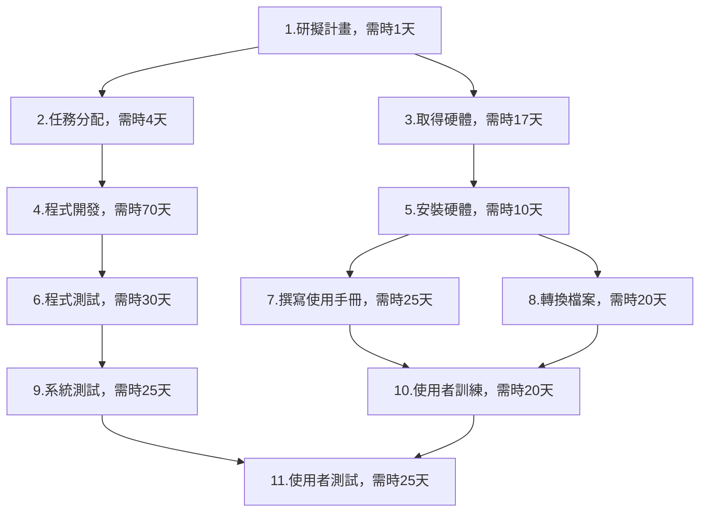
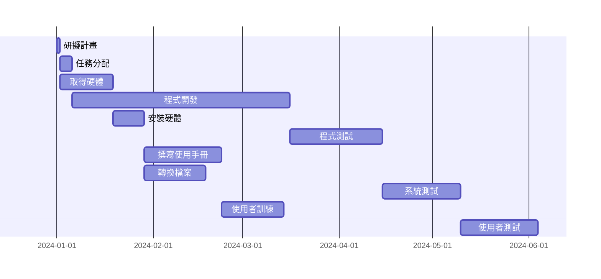
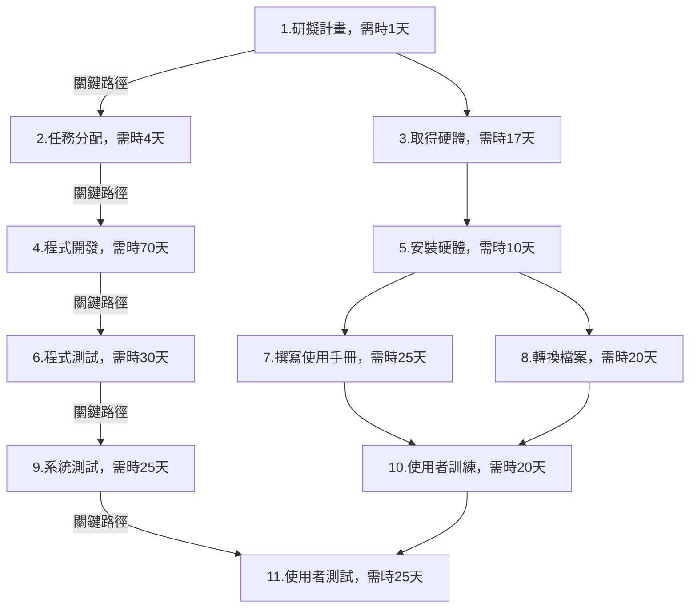

# hw2

### PERT/CPM 圖

```mermaid
graph TD
    A[1.研擬計畫，需時1天] --> B[2.任務分配，需時4天]
    A --> C[3.取得硬體，需時17天]
    B --> D[4.程式開發，需時70天]
    C --> E[5.安裝硬體，需時10天]
    D --> F[6.程式測試，需時30天]
    E --> G[7.撰寫使用手冊，需時25天]
    E --> H[8.轉換檔案，需時20天]
    F --> I[9.系統測試，需時25天]
    G --> J[10.使用者訓練，需時20天]
    H --> J
    I --> K[11.使用者測試，需時25天]
    J --> K
```
### 甘特圖

```mermaid
gantt
    dateFormat  YYYY-MM-DD
    axisFormat  %Y-%m-%d

    研擬計畫           :a1, 2024-01-01, 1d
    任務分配           :a2, after a1, 4d
    取得硬體           :a3, after a1, 17d
    程式開發           :a4, after a2, 70d
    安裝硬體           :a5, after a3, 10d
    程式測試           :a6, after a4, 30d
    撰寫使用手冊        :a7, after a5, 25d
    轉換檔案           :a8, after a5, 20d
    系統測試           :a9, after a6, 25d
    使用者訓練         :a10, after a7, 20d
    使用者測試         :a11, after a9, 25d

```
### 關鍵路徑圖

```mermaid
graph TD
    A[1.研擬計畫，需時1天] -->|關鍵路徑| B[2.任務分配，需時4天]
    B -->|關鍵路徑| D[4.程式開發，需時70天]
    D -->|關鍵路徑| F[6.程式測試，需時30天]
    F -->|關鍵路徑| I[9.系統測試，需時25天]
    I -->|關鍵路徑| K[11.使用者測試，需時25天]

    A --> C[3.取得硬體，需時17天]
    C --> E[5.安裝硬體，需時10天]
    E --> G[7.撰寫使用手冊，需時25天]
    E --> H[8.轉換檔案，需時20天]
    G --> J[10.使用者訓練，需時20天]
    H --> J
    J --> K
```

